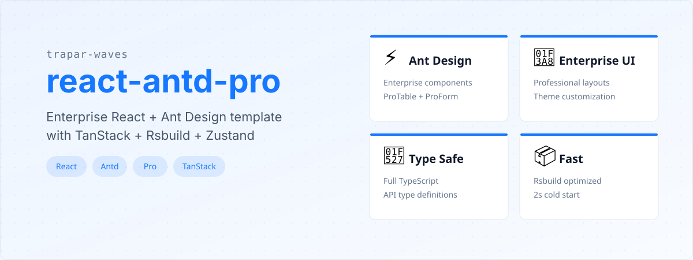
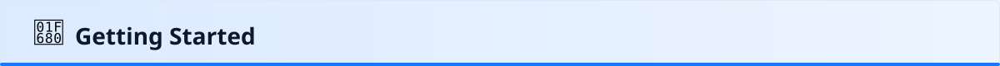
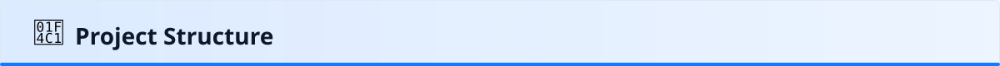
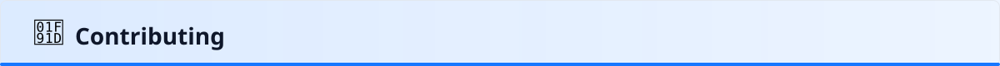
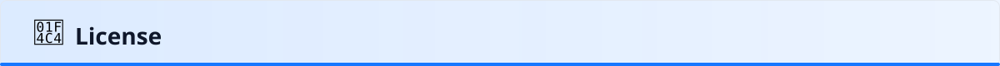

# @trapar-waves/react-antd-pro


---

[中文](./readme/README-CN.md) | [日本語](./readme/README-JP.md) | [Русский язык](./readme/README-RU.md)

> An enterprise application development template based on React 19 and Ant Design Pro 5, integrating TanStack toolchain (Router/Query), Rsbuild build tool, and Tailwind CSS styling solution, focusing on efficient development and type safety.




## ✨ Features

- **Modern Framework:** Built on React 19, supporting component-based development and hooks pattern.
- **Enterprise UI:** Integrates Ant Design 5 basic components + Ant Design Pro business components (including ProTable/ProForm, etc.).
- **Type Safety:** Full TypeScript development with complete type systems covering API type definitions and state type checks.
- **Rapid Build:** Uses Rsbuild instead of traditional webpack, achieving cold start of development server in 2 seconds.
- **Intelligent Routing:** File-based routing with TanStack Router, auto-generating route configurations (supports nested routes).
- **State Management:** Adopts lightweight Zustand instead of complex Redux, providing composable atomic state solutions.
- **Data Fetching:** Wrapped Axios instance + TanStack Query (v5) for automatic request caching/retry/pagination.
- **Styling Solution:** Integrated Tailwind CSS v4 + CSS Modules, supporting theme configuration and responsive design.
- **Debugging Tools:** Built-in TanStack DevTools (Query/Router) and Rsbuild build analysis panel.
- **Animation Enhancement:** Implements transition animations (e.g., route switching, component show/hide) via Motion library.


## 💻 Tech Stack

- **Base Framework:** `React` — Core for component-based development.
- **UI Component Library:** `Ant Design` & `Ant Design Pro` — Enterprise-level basic components & business component library (ProTable/ProForm).
- **State Management:** `Zustand` — Lightweight state management solution.
- **Routing:** `TanStack Router` — File-based routing + type-safe config.
- **Data Fetching:** `Axios` & `TanStack Query` — HTTP client wrapper & server state management (auto-cache/retry).
- **Build Tool:** `Rsbuild` — Modern build tool based on webpack.
- **Styling Solution:** `Tailwind CSS` & `CSS Modules` — Atomic CSS framework & local scoped component styles.
- **Type System:** `TypeScript` — Static type checking.
- **Debugging Tools:** `TanStack DevTools` — Query/Router debugging panel.
- **Animation:** `Motion` — Declarative animation library (route/component transitions).

See the [package.json](./package.json) for a full list of dependencies.



## 🚀 Getting Started

### Prerequisites

- Node.js (>= 18.x recommended)
- Package manager (npm, yarn, or pnpm)

### Installation

1. Create a new project using the template:

   ```bash
   pnpm create trapar-waves
   ```

2. Navigate to your project directory and install dependencies:

   ```bash
   pnpm install
   ```

3. Start the development server:

   ```bash
   pnpm dev
   ```



## 📁 Project Structure

```
├── public/             # Static assets
├── mock/               # Mock data for development
├── src/                # Source code
│   ├── api/            # API layer (Axios instance, type definitions)
│   ├── hooks/          # Custom React hooks
│   ├── layout/         # Application layout components
│   ├── pages/          # Page-level components
│   ├── routes/         # TanStack Router file-based routes
│   ├── store/          # Zustand state management
│   ├── themes/         # Theme configuration
│   ├── global.css      # Global styles and Tailwind imports
│   ├── index.tsx       # Entry point
│   └── router.ts       # Router configuration
├── rsbuild.config.ts   # Rsbuild configuration
├── tsconfig.json       # TypeScript configuration
├── eslint.config.js    # ESLint configuration
└── package.json        # Project dependencies and scripts
```



## 🤝 Contributing

Contributions are welcome and greatly appreciated! Please follow these steps to contribute:

1. Fork the repository
2. Create your feature branch (`git checkout -b feature/amazing-feature`)
3. Commit your changes (`git commit -m 'Add some amazing feature'`)
4. Push to the branch (`git push origin feature/amazing-feature`)
5. Open a Pull Request



## 📄 License

MIT License © 2025 Trapar Waves

## 👤 Author

- **Rikka:** [admin@rikka.cc](mailto:admin@rikka.cc)
- **GitHub Profile:** [Muromi-Rikka](https://github.com/Muromi-Rikka)

## 🔗 Links

- **Repository:** [https://github.com/Trapar-waves/react-antd-pro](https://github.com/Trapar-waves/react-antd-pro)
- **Issues:** [https://github.com/Trapar-waves/react-antd-pro/issues](https://github.com/Trapar-waves/react-antd-pro/issues)
